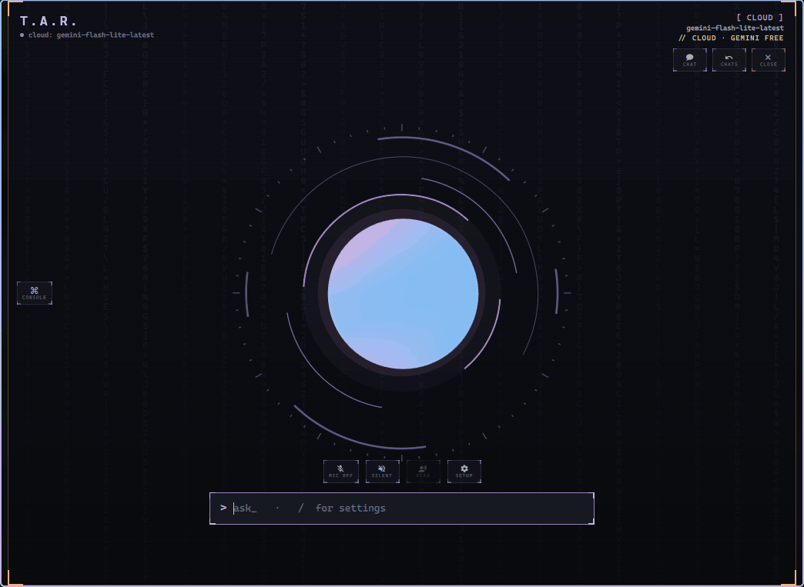
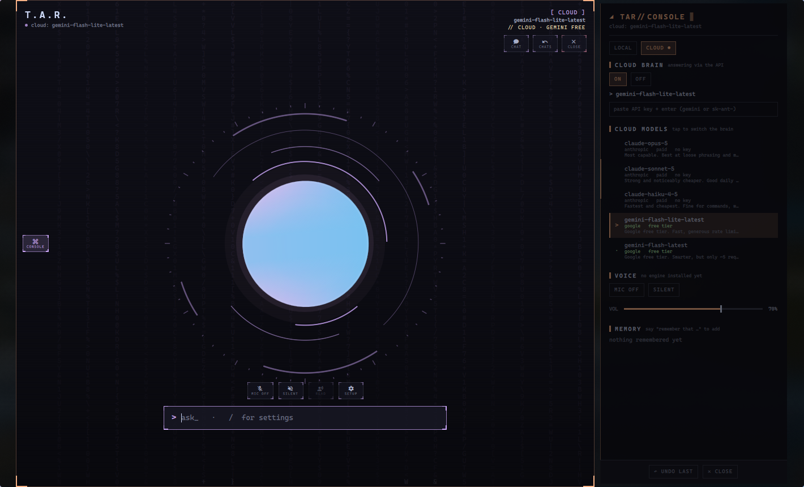

<div align="center">

# T.A.R.

**A JARVIS-style desktop assistant for Hyprland — that actually does things.**

Talk to it in plain language and it operates your machine: opens and closes apps,
moves windows, manages files, controls wifi, bluetooth, audio and media, sets
reminders, searches the web — with a free cloud brain or a fully offline one.




</div>

---

## Contents

- [Features](#features)
- [Screenshots](#screenshots)
- [Requirements](#requirements)
- [Install](#install)
- [Getting started](#getting-started)
- [What you can say](#what-you-can-say)
- [Slash commands](#slash-commands)
- [Cloud vs local brain](#cloud-vs-local-brain)
- [Safety](#safety)
- [How it works](#how-it-works)
- [Privacy](#privacy)
- [Roadmap](#roadmap)
- [License](#license)

## Features

- **Real control, not a chatbot** — 136 built-in actions covering windows, apps,
  files, wifi, bluetooth, audio, media, power, reminders and more, plus a guarded
  shell for anything else. Every action reports VERIFIED / NOT VERIFIED.
- **Two brains** — a cloud brain with proper tool calling (free: Google Gemini, Groq,
  Mistral, OpenRouter · paid: Anthropic Claude), or a fully offline local model
  through Ollama. When one free quota runs out, T.A.R. switches to your strongest
  other provider before falling back to a weaker model.
- **Mini orb** — a small draggable orb that stays on screen while T.A.R. runs.
  Click it to type, see the full reply and manage background tasks; while T.A.R.
  clicks or types for you, it flies to each spot and narrates in a speech bubble.
- **Research** — "look up X" searches the web, reads the top pages and answers in a
  few sentences with clickable source links.
- **File safety check** — "scan the usb" / "is this file safe?" judges files by what
  they're built to do (import table, MITRE ATT&CK techniques with evidence), never
  by their name. Optional VirusTotal hash lookup, never uploads.
- **Plays games** — "play cookie clicker" finds or opens the game and plays it in the
  background (autoclicker + an AI buying round), pausing if the game leaves the
  screen or you grab the mouse.
- **Screen effects it can write itself** — matrix rain, snow, fireworks, a black
  hole, a real screen shake… and with `exec`, T.A.R. writes new effects on the
  spot, runs them and fixes its own errors.
- **Instant commands** — unambiguous requests ("volume 40", "next song", "close it")
  are matched and run locally in ~0.2 s without calling any model.
- **Understands follow-ups** — "open a terminal and run btop", then "close it".
  T.A.R. remembers which windows *it* opened and never touches the ones you were
  already using.
- **Promptable personality** — a natural default voice, or describe your own with
  `/persona`.
- **Effects & easter eggs** — glitch, scanline, shockwave, matrix takeover, party
  mode, a fake self-destruct… all plain-QML, cheap enough to stay at 60 fps.
- **Memory** — "remember that my teacher is Dana" goes into T.A.R.'s memory and
  persists across sessions ("forget that…" removes it); past chats are kept and can
  be reopened.
- **Looks the part** — orb and chat views, a slide-out console, matrix rain, and
  colours that follow your Matugen theme.

## Screenshots

| Orb view | Console + cloud models |
|:---:|:---:|
|  |  |

## Requirements

**Required:** [Hyprland](https://hyprland.org), [Quickshell](https://quickshell.org)
(`qs`), Python 3.11+, `jq`.

**Optional** — each one unlocks the features next to it; `./install.sh --check`
tells you what's missing:

| Tool | Used for |
|---|---|
| `wlrctl` (AUR) | clicking, scrolling and dragging on screen |
| `wtype` | typing and key presses |
| `grim`, `slurp` | screenshots |
| `playerctl` | media control |
| `pactl` (PipeWire/Pulse) | volume |
| `brightnessctl` | brightness |
| `nmcli`, `bluetoothctl` | wifi, bluetooth |
| `notify-send` | notifications and reminders |
| `curl` | weather, downloads, the cloud brain |
| `trash-cli` | deleting to the trash (recoverable) |
| `fd`, `qalculate` | file search, calculator / unit conversion |
| `wf-recorder`, `hyprsunset`, `hyprpicker`, `cliphist` | recording, night light, colour picker, clipboard history |
| `tesseract`, `ffmpeg` | reading the screen (OCR), camera |
| `ollama` | the offline local brain |

On Arch (Quickshell may need the AUR, e.g. `yay -S quickshell`):

```sh
sudo pacman -S quickshell hyprland python jq wtype grim slurp playerctl \
  brightnessctl networkmanager bluez-utils libnotify curl trash-cli fd \
  libqalculate wf-recorder hyprsunset hyprpicker cliphist tesseract \
  tesseract-data-eng ffmpeg
yay -S wlrctl      # clicking (AUR)
```

## Install

```sh
git clone https://github.com/GLITCH-BITE-404/T.A.R..git
cd T.A.R.
./install.sh
```

The installer copies T.A.R. into `~/.config/hypr/scripts/quickshell`, links the
`tar-ai` launcher into `~/.local/bin`, and reports missing optional tools. It is
safe to re-run, and it never overwrites your own Quickshell helper files —
the fallbacks in [`compat/`](../compat) are only used when yours are missing.

> T.A.R. ships as part of the **BITE-OS** Hyprland rice, where it's preinstalled.

## Getting started

```sh
tar-ai          # open T.A.R. (or focus it if it's already open)
tar-ai new      # open it with a fresh chat
```

Turn on the free cloud brain (recommended — it's far smarter and faster than
anything a laptop can run locally):

1. Get a free API key at <https://aistudio.google.com/apikey>.
2. In T.A.R., type `/key <your-key>` and then `/cloud`.

Or open the **console** (left edge) → **CLOUD** tab, paste the key, and tap **ON**.

## What you can say

Plain language works — you don't need exact phrases. Some examples:

| Area | Try |
|---|---|
| Apps & windows | "open firefox" · "close it" · "close everything but tar" · "move kitty to workspace 3" · "make it fullscreen" |
| Terminal | "open a terminal and run btop" |
| Web | "open youtube" · "google arch wiki and open the first link" · "play lofi on youtube" |
| Files | "what's in my downloads" · "find my notes file" · "make a folder called projects on my desktop" · "delete that" (goes to the trash) |
| System | "turn wifi off" · "connect my headphones" · "battery" · "what's using my cpu" · "suspend" |
| Audio & media | "volume 40" · "turn it up" · "next song" · "pause the music" |
| Time | "remind me in 10 minutes to drink water" · "set a timer for 5 minutes" · "what time is it" |
| Info | "what's the weather in tel aviv" · "convert 20 euros to shekels" · "15% of 80" |
| Desktop | "night light on" · "do not disturb on" · "pick a colour" · "start recording" · "take a screenshot" |
| Memory | "remember that my main browser is chrome" · "forget that…" |
| Research | "look up when the chanukah break starts" · "research the best budget laptop" |
| Safety | "scan the usb" · "is rans0m.exe safe?" · "check my downloads for viruses" |
| Games | "play cookie clicker" · "play it for 10 minutes" · "stop" |
| Screen effects | "make a matrix rain on my screen" · "make it snow" · "shake my screen" · "show fireworks" · "exec make a black hole that sucks in orbs" |
| Fun | "flip a coin" · "roll a d20" · "do a barrel roll" · …and a few hidden ones |

## Slash commands

Type `/` in T.A.R. to see them all.

| Command | Does |
|---|---|
| `/new` | start a new chat |
| `/cloud` · `/cloud off` | switch to the cloud brain · back to local |
| `/key` | add an API key: pick Gemini, Groq, Mistral, OpenRouter, Anthropic or VirusTotal, get a link to a free key, paste it (hidden) |
| `/model <name>` | pick a model, e.g. `/model gemini-flash-latest` |
| `/models` | list local and cloud models |
| `/persona <text>` · `/persona reset` | change how T.A.R. talks · back to default |
| `/chats` | browse and reopen past conversations |
| `/settings` | capabilities, engines and devices |
| `/speak on\|off` | read replies aloud |
| `/stop` | stop the current reply |
| `exec <request>` | do it for real — no T.A.R. animation as a stand-in; writes a new screen effect if needed |
| `/clear` | clear the transcript |

## Cloud vs local brain

| | Cloud (Gemini / Groq / Mistral / OpenRouter / Claude) | Local (Ollama) |
|---|---|---|
| Smarts | strong; real tool calling, handles loose phrasing and follow-ups | limited on laptop-sized models |
| Speed | ~1–2 s per reply | depends heavily on your CPU/GPU |
| Cost | Gemini, Groq, Mistral, OpenRouter: free tiers · Claude: pay per use | free |
| Privacy | your messages go to the provider | nothing leaves your machine |
| Full shell access | yes (guarded) | no |

Free-tier tip: `gemini-flash-lite-latest` (the default) has a generous rate
limit; `gemini-flash-latest` is smarter but allows only a few requests per minute.

## Safety

T.A.R. runs on *your* machine, so it is fenced off from the irreversible stuff:

- **Never as root.** `sudo`, package installs/removals and anything that writes to
  system paths (`/etc`, `/usr`, `/boot`, …) are refused — T.A.R. tells you the exact
  command to run yourself instead.
- **Deletes go to the trash**, never `rm`, so they can be restored ("restore …").
- **File actions stay inside your home folder.**
- **No disk tools**, bootloader, pacman hooks or session-critical services.
- **Window actions never target T.A.R. itself**, and plural closes ("close them")
  only touch windows T.A.R. opened.
- Reboot, shutdown and logout give a 5-second warning.
- The local model never gets shell access.

## How it works

```
 Quickshell UI (QML)                       Python backend (one JSON object per line)
┌──────────────────────────┐   spawn   ┌──────────────────────────────────────────┐
│ TarHarness.qml  window   │ ────────▶ │ tar_brain.py   routing, memory, history,  │
│ tar/tar.qml     main UI  │           │                local Ollama models        │
│ TarOrbView.qml  orb view │ ◀──────── │ tar_tools.py   77 actions + the instant   │
│ TarConsole.qml  console  │  JSON     │                regex command matcher      │
│ TarFx.qml       effects  │  events   │ tar_cloud.py   Gemini / Claude tool calls │
└──────────────────────────┘           │ tar_caps.py    capabilities & engines     │
                                       └──────────────────────────────────────────┘
```

1. A message first goes through a deterministic matcher — clear commands run
   instantly with no model at all.
2. Anything else goes to the selected brain. In cloud mode the model gets every
   action as a tool and calls them itself, several per turn if needed.
3. Actions stream back as events, so the UI shows exactly what ran — T.A.R. can't
   claim to have done something it didn't.

| Path | What's stored |
|---|---|
| `~/.local/share/bite-os/tar/config.json` | settings (brain, model, persona, voice) |
| `~/.local/share/bite-os/tar/keys.json` | API keys (mode `600`, never in the repo) |
| `~/.local/share/bite-os/tar/sessions/` | chat history |

## Privacy

- In **cloud mode**, your messages and the results of actions (window titles, file
  names T.A.R. looked up, etc.) are sent to the provider you chose. Google's free
  tier may use that data to improve its models.
- API keys are stored locally, readable only by you.
- When T.A.R. reads your clipboard history, anything that looks like a key or token
  is masked before it reaches the model.
- **Local mode** sends nothing anywhere.

## Roadmap

- [x] Voice loop: push-to-talk dictation → reply → speech
- [x] Wake word
- [ ] Files: "the PDF my teacher sent last week", organize, convert to PDF
- [ ] System upkeep: updates, disk space, caches, failed services
- [ ] Write & send: email / WhatsApp drafts, sent only after you say yes
- [ ] Homework helper and Google Classroom
- [ ] Camera frames into a vision model ("what am I holding?")
- [ ] Packaging for the BITE-OS ISO / AUR

See [CHANGELOG.md](CHANGELOG.md) for release history.

## License

[MIT](../LICENSE) © GLITCH-BITE-404
